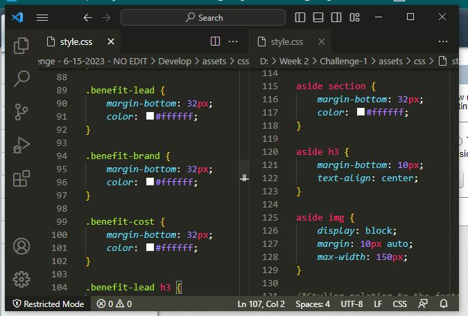

# Challenge 01 - Semantic Code Refactor

## Description

The source HTML and CSS code of the Horiseon Social Solution Services webpage was reviewed and simplified with the use of semantic HTML tags and the reduction of redundant CSS code. This will benefit the webpage by making it more accessible to users utilizing screen readers and other related accessibility technologies. Additionally, the removal of redundant CSS code will make it efficient for browsers to render and to easier add/edit the styling of the page in the future.

## Installation

There is no Installation involved on the users side to utilize this webpage; just visit [https://hello-andyjoe.github.io/Challenge-1/](https://hello-andyjoe.github.io/Challenge-1/)

## Usage

From the user perspective, there's no additional usage beyond just reviewing the copy on the site.

When inspecting the code, it can be observed in the HTML code the use of semantic code in favor of div elements with class attributes. The replacing of div elements with class attributes also meant that CSS code could be combined in several instances.

The example shown below is three snippets of CSS code that are identical in purpose being combined into one snippet with the use of a semantic HTML element.

## Credits

Original HTML and CSS code provided by Horiseon Social Solution Services, Inc. ie: ASU Bootcamp Course

## License

MIT License

Copyright (c) 2023 Hello-AndyJoe

Permission is hereby granted, free of charge, to any person obtaining a copy
of this software and associated documentation files (the "Software"), to deal
in the Software without restriction, including without limitation the rights
to use, copy, modify, merge, publish, distribute, sublicense, and/or sell
copies of the Software, and to permit persons to whom the Software is
furnished to do so, subject to the following conditions:

The above copyright notice and this permission notice shall be included in all
copies or substantial portions of the Software.

THE SOFTWARE IS PROVIDED "AS IS", WITHOUT WARRANTY OF ANY KIND, EXPRESS OR
IMPLIED, INCLUDING BUT NOT LIMITED TO THE WARRANTIES OF MERCHANTABILITY,
FITNESS FOR A PARTICULAR PURPOSE AND NONINFRINGEMENT. IN NO EVENT SHALL THE
AUTHORS OR COPYRIGHT HOLDERS BE LIABLE FOR ANY CLAIM, DAMAGES OR OTHER
LIABILITY, WHETHER IN AN ACTION OF CONTRACT, TORT OR OTHERWISE, ARISING FROM,
OUT OF OR IN CONNECTION WITH THE SOFTWARE OR THE USE OR OTHER DEALINGS IN THE
SOFTWARE.
